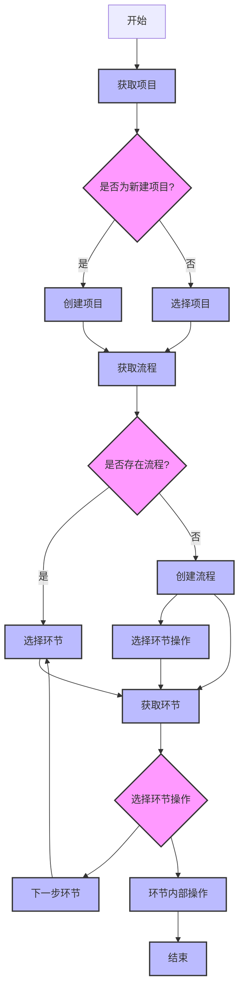

# 整体流程

```mermaid
graph TD
    A[开始] --> B[获取项目]
    B --> C{是否为新建项目?}
    C -->|是| D[创建项目]
    C -->|否| E[选择项目]
    D --> F[获取流程]
    E --> F
    F --> G{是否存在流程?}
    G -->|是| H[选择环节]
    G -->|否| I[创建流程]
    I --> J[选择环节操作]
    J --> K[获取环节]   
    H --> K
    K --> L{选择环节操作}
    L --> M[下一步环节]
    L --> N[环节内部操作]
    N --> O[结束]      
    I --> K[获取环节]   
    M --> H

    classDef decision fill:#f9f,stroke:#333,stroke-width:2px;
    classDef process fill:#bbf,stroke:#333,stroke-width:2px;
    class C,G,L decision;
    class B,D,E,F,H,I,J,K,M,N,O process;
```
