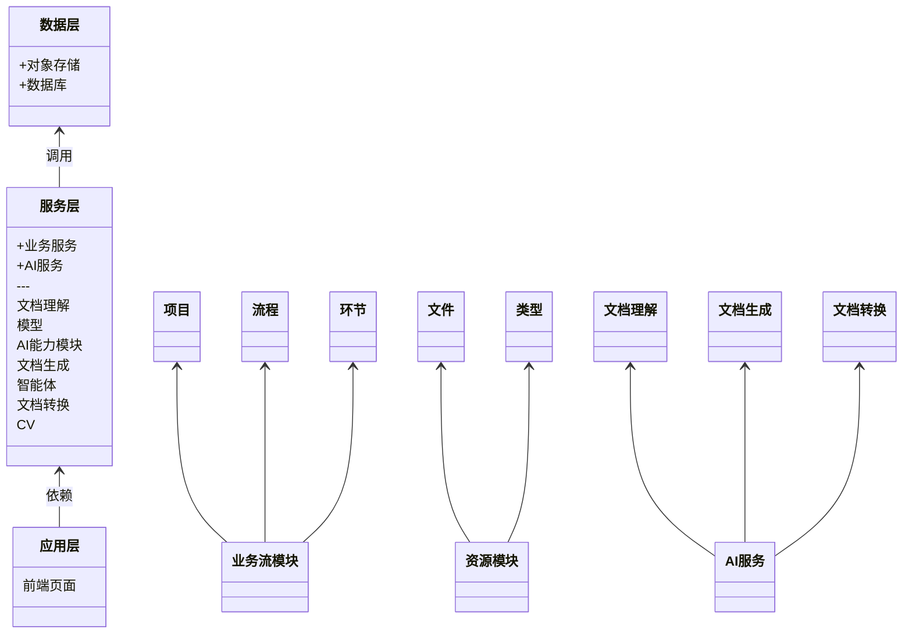

# 系统架构设计

```mermaid
classDiagram
    direction BT
    
    class 应用层 {
        前端页面
    }
    
    class 服务层 {
        +业务服务
        +AI服务
        ---
        文档理解
        模型
        AI能力模块
        文档生成
        智能体
        文档转换
        CV
    }
    
    %% 数据层
    class 数据层 {
        +对象存储
        +数据库
    }
    
    %% 层级关系
    应用层 --> 服务层 : 依赖
    服务层 --> 数据层 : 调用
    
    %% 模块关联
    业务流模块 --> 项目
    业务流模块 --> 流程
    业务流模块 --> 环节
    资源模块 --> 文件
    资源模块 --> 类型
    AI服务 --> 文档理解
    AI服务 --> 文档生成
    AI服务 --> 文档转换
    
```
